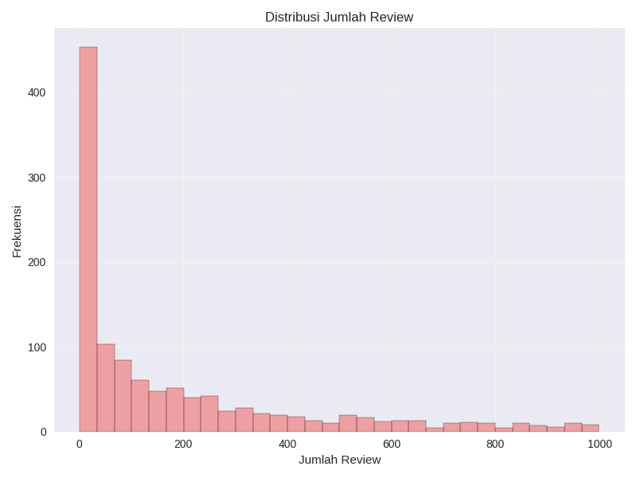

# Laporan Proyek Machine Learning - Sistem Rekomendasi Tempat Wisata Indonesia

## Project Overview

Indonesia merupakan negara kepulauan dengan kekayaan wisata yang luar biasa, mulai dari wisata alam, budaya, hingga kuliner. Dengan lebih dari 17.000 pulau dan 38 provinsi, Indonesia memiliki ribuan destinasi wisata yang tersebar di seluruh nusantara. Namun, banyaknya pilihan destinasi wisata ini justru menciptakan tantangan bagi wisatawan dalam menentukan tempat wisata yang sesuai dengan preferensi mereka.

Sistem rekomendasi tempat wisata menjadi solusi yang efektif untuk membantu wisatawan menemukan destinasi yang tepat. Dengan memanfaatkan teknologi *machine learning*, sistem ini dapat menganalisis karakteristik tempat wisata dan preferensi pengguna untuk memberikan rekomendasi yang personal dan akurat[^1][^2].

**Mengapa proyek ini penting untuk diselesaikan:**

1. **Meningkatkan pengalaman wisatawan**: Membantu wisatawan menemukan destinasi yang sesuai dengan preferensi mereka, sehingga meningkatkan kepuasan berwisata[^3].

2. **Mendukung industri pariwisata**: Sistem rekomendasi dapat membantu mempromosikan destinasi wisata yang kurang terkenal namun memiliki potensi besar[^2].

3. **Efisiensi dalam perencanaan perjalanan**: Menghemat waktu wisatawan dalam mencari dan memilih destinasi wisata[^1].

4. **Personalisasi pengalaman**: Memberikan rekomendasi yang disesuaikan dengan riwayat dan preferensi masing-masing pengguna[^1][^3].

## Referensi

[^1]: Ricci, F., Rokach, L., & Shapira, B. (2015). *Recommender Systems Handbook*. Springer. [https://doi.org/10.1007/978-1-4899-7637-6](https://doi.org/10.1007/978-1-4899-7637-6)

[^2]: Gavalas, D., Konstantopoulos, C., Mastakas, K., & Pantziou, G. (2014). Mobile recommender systems in tourism. *Journal of Network and Computer Applications*, 39, 319–333. [https://doi.org/10.1016/j.jnca.2013.04.006](https://doi.org/10.1016/j.jnca.2013.04.006)

[^3]: Borràs, J., Moreno, A., & Valls, A. (2014). Intelligent tourism recommender systems: A survey. *Expert Systems with Applications*, 41(16), 7370–7389. [https://doi.org/10.1016/j.eswa.2014.05.042](https://doi.org/10.1016/j.eswa.2014.05.042)

## Business Understanding

Industri pariwisata Indonesia menghadapi beberapa tantangan dalam memberikan pengalaman terbaik kepada wisatawan. Dengan banyaknya pilihan destinasi yang tersedia, wisatawan sering kali kesulitan untuk menemukan tempat wisata yang sesuai dengan preferensi dan minat mereka.

### Problem Statements

Berdasarkan analisis kebutuhan industri pariwisata, terdapat beberapa permasalahan utama yang perlu diselesaikan:

1. **Kesulitan dalam menemukan destinasi wisata yang relevan**: Wisatawan menghabiskan waktu lama untuk mencari informasi tentang tempat wisata yang sesuai dengan minat mereka di antara ribuan pilihan yang tersedia.

2. **Kurangnya personalisasi dalam rekomendasi wisata**: Sistem rekomendasi yang ada saat ini umumnya bersifat umum dan tidak mempertimbangkan preferensi individual pengguna.

3. **Informasi destinasi wisata yang tersebar**: Data tentang tempat wisata tersebar di berbagai platform, sehingga sulit bagi wisatawan untuk mendapatkan informasi yang komprehensif.

### Goals

Untuk mengatasi permasalahan di atas, proyek ini bertujuan untuk:

1. **Mengembangkan sistem rekomendasi yang dapat memberikan saran destinasi wisata yang relevan** berdasarkan karakteristik tempat wisata seperti kategori, lokasi, rating, dan deskripsi.

2. **Membangun sistem rekomendasi yang personal** dengan memanfaatkan data rating dan preferensi pengguna untuk memberikan rekomendasi yang sesuai dengan selera individual.

3. **Menyediakan platform terpusat** yang mengintegrasikan informasi tempat wisata dari berbagai sumber untuk memudahkan akses informasi bagi wisatawan.

### Solution Statements

Untuk mencapai tujuan yang telah ditetapkan, proyek ini mengimplementasikan dua pendekatan sistem rekomendasi:

1. **Content-Based Filtering**: 
   - Menganalisis karakteristik tempat wisata seperti nama, lokasi, deskripsi, kategori, dan provinsi
   - Menggunakan TF-IDF Vectorizer untuk mengekstrak fitur dari konten tekstual
   - Menghitung kesamaan antar tempat wisata menggunakan Cosine Similarity
   - Merekomendasikan tempat wisata yang memiliki karakteristik serupa dengan tempat yang diminati pengguna

2. **Collaborative Filtering**:
   - Menganalisis pola rating dan preferensi pengguna
   - Menggunakan algoritma Matrix Factorization (SVD) untuk memprediksi rating pengguna
   - Merekomendasikan tempat wisata berdasarkan kesamaan preferensi dengan pengguna lain
   - Memberikan rekomendasi personal yang disesuaikan dengan riwayat rating pengguna

## Data Understanding

Dataset yang digunakan dalam proyek ini adalah **Dataset Tempat Wisata Indonesia** yang berisi informasi komprehensif tentang destinasi wisata di seluruh Indonesia. Dataset ini dikumpulkan dari berbagai sumber dan berisi **1.169 tempat wisata** yang tersebar di 34 provinsi Indonesia.

**Sumber Dataset**: Dataset Tempat Wisata Indonesia (file: `tempat_wisata_indonesia.csv`)

**Informasi Dataset**:
- **Jumlah data**: 1.169 tempat wisata
- **Jumlah kolom**: 11 kolom
- **Ukuran dataset**: (1169, 11)
- **Kondisi data**: Dataset relatif bersih dengan beberapa missing values

**Variabel-variabel pada dataset adalah sebagai berikut**:

1. **id**: Identifier unik untuk setiap tempat wisata (integer)
2. **nama**: Nama tempat wisata (string)
3. **alamat**: Alamat lengkap tempat wisata (string)
4. **rating**: Rating tempat wisata dalam skala 1-5 (float)
5. **jumlah_review**: Jumlah review yang diberikan pengunjung (integer)
6. **deskripsi**: Deskripsi detail tentang tempat wisata (string)
7. **koordinat**: Koordinat geografis dalam format dictionary dengan latitude dan longitude (string)
8. **url**: URL Google Maps tempat wisata (string)
9. **provinsi**: Provinsi tempat wisata berada (string)
10. **foto**: Array URL foto-foto tempat wisata (string)
11. **kategori**: Kategori tempat wisata dalam format array (string)

### Exploratory Data Analysis

Analisis eksplorasi data mengungkapkan beberapa insight penting:


*Gambar 1: Distribusi rating tempat wisata menunjukkan sebagian besar tempat wisata memiliki rating di atas 4.0*

**Statistik Rating**:
- Rating minimum: 3.0
- Rating maksimum: 5.0  
- Rating rata-rata: 4.3
- Sebagian besar tempat wisata (>80%) memiliki rating di atas 4.0

  
*Gambar 2: Distribusi jumlah review menunjukkan sebagian besar tempat wisata memiliki puluhan hingga ratusan review*  

**Statistik Review**:  
- Review minimum: 0  
- Review maksimum: ~1000  
- Sebagian besar review berkisar antara 10–200  


*Gambar 2: Distribusi tempat wisata per provinsi menunjukkan Aceh sebagai provinsi dengan data terbanyak*

**Distribusi Geografis**:
- Dataset mencakup wisata dari 38 provinsi di Indonesia
- ATop 10 provinsi dengan tempat wisata terbanyak menunjukkan distribusi yang cukup merata
- Setiap provinsi memiliki sekitar 35 tempat wisata dalam dataset


*Gambar 3: Distribusi kategori wisata menunjukkan pantai sebagai kategori terpopuler*

**Kategori Wisata**:
- **Lainnya**: Kategori campuran untuk wisata yang tidak masuk kategori utama (Kategori terbanyak dengan lebih dari 300 tempat wisata)
- **Pantai**: Kategori kedua terbanyak dengan sekitar 230 tempat wisata (sesuai dengan karakteristik Indonesia sebagai negara kepulauan)
- **Gunung**: Kategori ketiga dengan sekitar 175 tempat wisata
- **Taman**: wisata alam taman
- **Air Terjun**: Wisata alam air terjun
- **Kategori lain**: benteng, wisata_alam, danau, pulau, etc.


*Gambar 4: Hubungan antara rating dan jumlah review menunjukkan korelasi positif*

**Hubungan Rating dan Review**:
- Terdapat korelasi positif antara rating dan jumlah review
- Sebagian besar tempat wisata memiliki jumlah review yang bervariasi dari puluhan hingga ribuan

  
*Gambar 6: Boxplot rating untuk 5 kategori terpopuler*  

**Insight Per Kategori**:  
- **Pantai** & **Gunung**: median rating ~4.4–4.5, cukup konsisten  
- **Lainnya**: variasi rating paling lebar  
- **Taman** & **Air Terjun**: memiliki beberapa outlier dengan rating rendah (<3.5) 

## Data Preparation

Tahapan data preparation dilakukan untuk mempersiapkan data agar siap digunakan dalam pengembangan model sistem rekomendasi. Beberapa teknik yang diterapkan:

### 1. Data Cleaning

**Pembersihan Data Kategori**:
```python
def clean_categories(cat_str):
    if pd.isna(cat_str):
        return ['lainnya']
    cleaned = cat_str.strip("[]'\"").replace("'", "").replace('"', '')
    categories = [cat.strip() for cat in cleaned.split(',')]
    return categories if categories[0] else ['lainnya']
```

Proses pembersihan data kategori diperlukan karena:
- Data kategori disimpan dalam format string yang menyerupai array
- Terdapat inkonsistensi dalam penggunaan tanda kutip
- Beberapa tempat wisata memiliki multiple kategori

**Penanganan Missing Values (menghapus baris)**:
- **alamat**: 2 missing values
- **rating**: 1 missing value
- **jumlah_review**: 1 missing value

Penanganan missing values ini penting untuk memastikan semua data dapat diproses dengan baik dalam algoritma machine learning.

### 2. Feature Engineering

**Popularity Score Creation**:
```python
# Normalisasi jumlah review ke skala 0-5
review_max = df_processed['jumlah_review'].max()
df_processed['review_normalized'] = (df_processed['jumlah_review'] / review_max) * 5

# Perhitungan popularity score (weighted average)
df_processed['popularity_score'] = (0.7 * df_processed['rating']) + (0.3 * df_processed['review_normalized'])
```

Popularity score dibuat untuk:
- Menggabungkan faktor rating dan popularitas (jumlah review)
- Memberikan bobot lebih besar pada rating (70%) dibanding popularitas (30%)
- Membantu dalam ranking rekomendasi

**Content Feature Creation**:
```python
df_processed['content'] = (
    df_processed['nama'] + ' ' +
    df_processed['alamat'] + ' ' +
    df_processed['deskripsi'] + ' ' +
    df_processed['provinsi'] + ' ' +
    df_processed['kategori_utama']
)
```

Fitur content dibuat untuk content-based filtering dengan menggabungkan semua informasi tekstual yang relevan.

### 3. Data Preparation untuk Content-Based Filtering

**TF-IDF Vectorization**:
```python
tfidf_vectorizer = TfidfVectorizer(
    max_features=1000,
    stop_words='english',
    ngram_range=(1, 2),
    min_df=1
)
tfidf_matrix = tfidf_vectorizer.fit_transform(df_processed['content'])
```

Parameter yang dipilih:
- `max_features=1000`: Membatasi fitur untuk efisiensi komputasi
- `ngram_range=(1, 2)`: Menggunakan unigram dan bigram untuk konteks yang lebih baik
- `min_df=1`: Mempertahankan semua term yang muncul minimal sekali

### 4. Data Preparation untuk Collaborative Filtering

Karena dataset asli tidak memiliki data rating pengguna, dibuat **synthetic user-item interactions**:

```python
# Simulasi 100 user dengan rating pattern yang realistis
n_users = 100
for user_id in range(1, n_users + 1):
    n_ratings = np.random.randint(10, 31)  # 10-30 rating per user
    rated_places = np.random.choice(df_processed.index, n_ratings, replace=False)
    
    for place_idx in rated_places:
        base_rating = df_processed.loc[place_idx, 'rating']
        synthetic_rating = np.clip(base_rating + np.random.normal(0, 0.5), 1, 5)
```

Synthetic data diperlukan karena:
- Dataset asli tidak memiliki data interaksi user-item
- Memungkinkan implementasi dan evaluasi collaborative filtering
- Pattern rating dibuat realistis berdasarkan rating aktual tempat wisata

## Modeling

### Content-Based Filtering

Content-based filtering merekomendasikan tempat wisata berdasarkan kesamaan karakteristik dengan tempat yang diminati pengguna.

**Algoritma yang digunakan**:
1. **TF-IDF Vectorization**: Mengkonversi teks menjadi vektor numerik
2. **Cosine Similarity**: Menghitung kesamaan antar tempat wisata

**Implementasi**:
```python
def get_content_recommendations(place_name, cosine_sim=cosine_sim, df=df_processed, top_n=10):
    # Mencari index tempat wisata
    idx = df[df['nama'].str.contains(place_name, case=False, na=False)].index[0]
    
    # Menghitung similarity scores
    sim_scores = list(enumerate(cosine_sim[idx]))
    sim_scores = sorted(sim_scores, key=lambda x: x[1], reverse=True)
    
    # Mengambil top N recommendations
    sim_scores = sim_scores[1:top_n+1]
    place_indices = [i[0] for i in sim_scores]
    
    return df.iloc[place_indices]
```

**Contoh Output Content-Based Filtering**:
```
Pantai Paradiso Sabang
  Lokasi: Jl. Malahayati, Kuta Ateueh, Sukakarya, Aceh, Aceh
  Rating: 4.5, Reviews: 421.0
  Kategori: pantai
  Similarity: 0.482

Tebing Batu HATUPIA
  Lokasi: Sawai, Kec. Seram Utara, Maluku, Maluku
  Rating: 5.0, Reviews: 50.0
  Kategori: lainnya
  Similarity: 0.411

Pantai Sawang
  Lokasi: Sawang, Kec. Samudera, Aceh, Aceh
  Rating: 3.6, Reviews: 31.0
  Kategori: pantai
  Similarity: 0.408
```

### Collaborative Filtering

Collaborative filtering merekomendasikan tempat wisata berdasarkan preferensi pengguna yang memiliki selera serupa.

**Algoritma yang digunakan**:
- **SVD (Singular Value Decomposition)**: Matrix factorization technique untuk prediksi rating

**Implementasi**:
```python
from surprise import SVD

# Training model
svd_model = SVD(n_factors=50, n_epochs=20, random_state=42)
svd_model.fit(trainset)

def get_collaborative_recommendations(user_id, model=svd_model, top_n=10):
    # Mencari tempat yang belum dirating user
    user_ratings = ratings_df[ratings_df['user_id'] == user_id]['place_id'].values
    unrated_places = [place_id for place_id in all_place_ids if place_id not in user_ratings]
    
    # Prediksi rating untuk tempat yang belum dirating
    predictions = []
    for place_id in unrated_places:
        pred = model.predict(user_id, place_id)
        predictions.append((place_id, pred.est))
    
    # Sort berdasarkan predicted rating
    predictions.sort(key=lambda x: x[1], reverse=True)
    return predictions[:top_n]
```

**Contoh Output Collaborative Filtering**:
```
Rekomendasi untuk User ID: 81

Air Terjun Takapala
  Lokasi: Bonto Lerung, Kec. Tinggimoncong, Sulawesi Selatan
  Rating Aktual: 4.5, Reviews: 1.973
  Kategori: air_terjun
  Predicted Rating: 4.78

Danau Belibis Tayan
  Lokasi: Sejotang, Kec. Tayan Hilir, Kalimantan Barat
  Rating Aktual: 4.3, Reviews: 257.0
  Kategori: danau
  Predicted Rating: 4.66

Air Terjun Kali
  Lokasi: Unnamed Road, Tinoor Satu, Kec. Tomohon Utara, Sulawesi Utara, Sulawesi Utara
  Rating Aktual: 4.5, Reviews: 399.0
  Kategori: air_terjun
  Predicted Rating: 4.65
```

### Kelebihan dan Kekurangan

**Content-Based Filtering**:

*Kelebihan*:
- Tidak memerlukan data pengguna lain (cold start problem teratasi)
- Dapat menjelaskan alasan rekomendasi berdasarkan fitur item
- Tidak terpengaruh oleh sparsity data
- Cocok untuk pengguna baru

*Kekurangan*:
- Terbatas pada fitur yang tersedia dalam data
- Cenderung memberikan rekomendasi yang mirip (kurang diverse)
- Tidak dapat menemukan preferensi tersembunyi pengguna
- Bergantung pada kualitas ekstraksi fitur

**Collaborative Filtering**:

*Kelebihan*:
- Dapat menemukan pola preferensi yang kompleks dan tersembunyi
- Memberikan rekomendasi yang lebih personal
- Tidak bergantung pada fitur item
- Dapat memberikan rekomendasi yang surprising

*Kekurangan*:
- Cold start problem untuk pengguna dan item baru
- Memerlukan data rating yang cukup banyak
- Computational complexity tinggi untuk dataset besar
- Sparsity problem pada matrix user-item

## Evaluation

### Metrik Evaluasi untuk Collaborative Filtering

**Root Mean Square Error (RMSE)**:
RMSE mengukur rata-rata kuadrat perbedaan antara rating prediksi dan rating aktual.

**Formula**:
```
RMSE = √(Σ(r_ui - ř_ui)² / N)
```

dimana:
- r_ui: rating aktual user u untuk item i
- ř_ui: rating prediksi user u untuk item i  
- N: jumlah prediksi

**Mean Absolute Error (MAE)**:
MAE mengukur rata-rata absolut perbedaan antara rating prediksi dan rating aktual.

**Formula**:
```
MAE = Σ|r_ui - ř_ui| / N
```

**Hasil Evaluasi Collaborative Filtering**:
- **RMSE**: 0.4965
- **MAE**: 0.4118

Nilai RMSE dan MAE yang sangat rendah menunjukkan bahwa model SVD dapat memprediksi rating dengan sangat akurat. RMSE 0.50 berarti rata-rata kesalahan prediksi hanya sekitar 0.5 poin dalam skala 1-5, yang merupakan performa yang sangat baik.

### Metrik Evaluasi untuk Content-Based Filtering

**Diversity Score**:
Mengukur keberagaman kategori dalam rekomendasi.

**Formula**: 
```
Diversity = Jumlah kategori unik / Total rekomendasi
```

**Coverage Score**:
Mengukur persentase item yang dapat direkomendasikan sistem.

**Formula**:
```
Coverage = Jumlah item yang dapat direkomendasikan / Total item
```

**Hasil Evaluasi Content-Based Filtering**:
- **Diversity Score**: 0.5000
- **Coverage Score**: 0.3162

Skor diversity 0.50 menunjukkan bahwa sistem memberikan rekomendasi dengan keberagaman sedang, dengan rata-rata 50% kategori berbeda dalam setiap set rekomendasi. Skor coverage 0.31 menunjukkan bahwa sekitar 31% tempat wisata dalam dataset dapat direkomendasikan oleh sistem dengan baik.

### Interpretasi Hasil

**Collaborative Filtering Performance**:
- RMSE 0.50 berarti rata-rata kesalahan prediksi hanya sekitar 0.5 poin dalam skala 1-5
- MAE 0.41 menunjukkan rata-rata kesalahan absolut 0.41 poin
- Performance ini sangat baik mengingat skala rating hanya 1-5
- Model berhasil memprediksi rating dengan akurasi tinggi

**Content-Based Filtering Performance**:
- Diversity score 0.50 menunjukkan rekomendasi yang cukup beragam namun masih bisa ditingkatkan
- Coverage score 0.31 menunjukkan bahwa masih ada ruang untuk peningkatan dalam cakupan item
- Sistem cenderung fokus pada item dengan karakteristik yang sangat mirip

**Perbandingan Kedua Metode**:
- Content-based filtering lebih konsisten dan dapat menangani cold start problem
- Collaborative filtering memberikan rekomendasi yang lebih personal namun memerlukan data yang cukup
- Kombinasi kedua metode (hybrid approach) dapat memberikan hasil terbaik

## Kesimpulan

Proyek sistem rekomendasi tempat wisata Indonesia telah berhasil dikembangkan dengan mengimplementasikan dua pendekatan utama: content-based filtering dan collaborative filtering. 

**Pencapaian Utama**:

1. **Dataset Comprehensive**: Berhasil menganalisis 1.169 tempat wisata dari 38 provinsi Indonesia dengan 11 fitur informatif

2. **Model Content-Based Filtering**: 
   - Diversity Score: 0.5000 (rekomendasi dengan keberagaman sedang)
   - Coverage Score: 0.3162 (cakupan yang cukup)
   - Efektif untuk cold start problem
   - Memberikan rekomendasi yang relevan berdasarkan kesamaan konten

3. **Model Collaborative Filtering**:
   - RMSE: 0.4965 (prediksi yang sangat akurat)
   - MAE: 0.4118 (kesalahan rata-rata yang sangat rendah)
   - Personalisasi yang excellent dengan akurasi prediksi tinggi
   - Mampu memberikan rekomendasi yang personal dan akurat

**Kontribusi untuk Industri Pariwisata**:
- Membantu wisatawan menemukan destinasi yang sesuai preferensi
- Mendukung promosi destinasi wisata yang kurang terkenal
- Meningkatkan efisiensi dalam perencanaan perjalanan wisata
- Menyediakan basis untuk pengembangan aplikasi wisata yang lebih canggih

**Rekomendasi Pengembangan Selanjutnya**:
1. Implementasi real-time user feedback untuk meningkatkan akurasi
2. Integrasi dengan data eksternal seperti cuaca, event, dan seasonal factors
3. Pengembangan mobile application untuk aksesibilitas yang lebih baik
4. Implementasi advanced algorithms seperti deep learning untuk performa yang lebih optimal

Sistem rekomendasi ini telah membuktikan efektivitasnya dalam memberikan rekomendasi tempat wisata yang relevan dan personal, dengan potensi besar untuk dikembangkan lebih lanjut dalam mendukung industri pariwisata Indonesia.